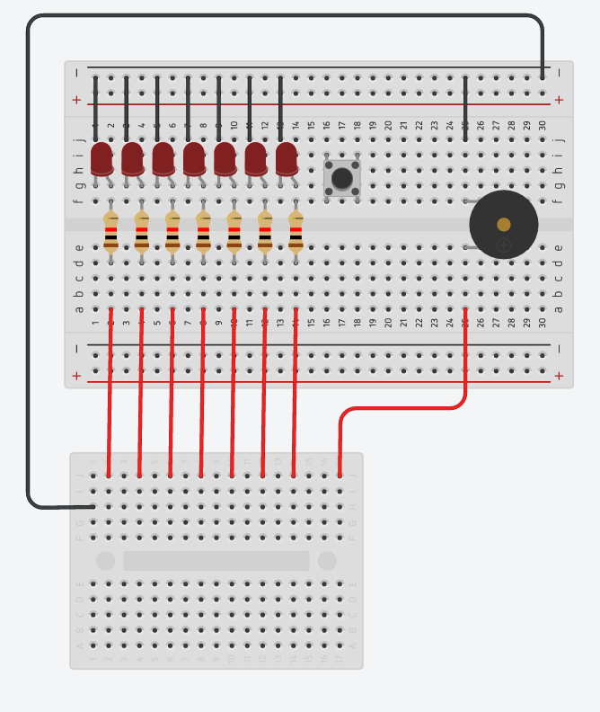

# Raspberry Pi LED Game Base

## Purpose

This game is created during Weldon Ridge Raspberry Pi Programming Camp 2016.
The purpose of the camp is to provide an interactive workshop to inspire
high school students in CS, EE, and math.

We create games on the Raspberry Pi because it's fun (and educational)!!!

This repository will contain an example program and some helpful documents.

## The Hardware

The hardware is simple. There are 7 LED lights, a buzzer and a button.

## The Games
Obama
### Catch the Light

If you ever played in an arcade, you must have seen the game with a lot of red lights and a button. The lights will light in sequence and you press the button and hope the light stop at the top. If your timing is right, then you get a lot of tickets. Well, this game is a mini version of that.

### Music Machine

Create a music machine that a player can select and play songs. When the song is playing, the LED also flashes the notes. Use one button to select songs, and another button to start/stop playing.

### Memory Game

The LED will flash in a random order in different speed for a few times. Player need to use two buttons, one move the LED light, and the other to select, and recall the same order.

### Binary Timer

Use the LED as a binary indicator. One button to set the time, 10 seconds increment per press. Use the other button to start the timer.

### How fast can you react?

Players press the button once an LED is lit. Reaction time is displayed in binary format with LED. use ms as unit.

### Grand Game Machine

Put all the games together. Use one button to select game. The other start the game.
